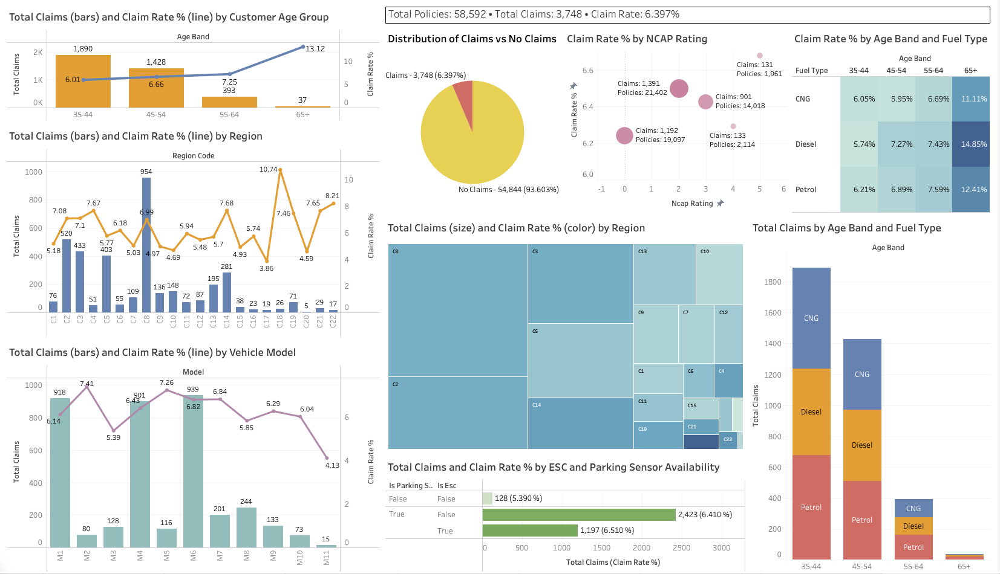

# Insurance Claims SQL + Tableau Dashboard

This project demonstrates end-to-end **data preparation, SQL analytics, and visualisation** of an insurance claims dataset with **58K+ policies**.  
The goal is to explore **claim rates** by region, customer demographics, vehicle models, and safety features, and to present the insights in an interactive **Tableau dashboard**.

---

## 📂 Project Structure

```
/insurance-claims-sql-project/
│
├── dashboard/
│   ├── Insurance Claims Dashboard.twb
│   └── dashboard_preview.png
│
├── docs/
│   ├── load_data_instructions.md  # step-by-step guide to import CSV and run SQL scripts
│   └── index.html		             # embed code to display Tableau Dashboard via GitHub Pages
│
├── raw data/                      # dataset
│   └── Insurance claims data.csv
│
├── results/                       # outputs of queries
│   ├── claims_by_age_region_fuel.csv
│   ├── claims_by_model.csv
│   ├── claims_by_age_group.csv
│   ├── claims_by_region.csv
│   └── claims_by_safety_features.csv
│
├── sql scripts/                   # all SQL scripts
│   ├── schema.sql                 # schema creation (staging + base tables)
│   ├── populate.sql               # insert data from staging to base tables
│   └── queries.sql                # analytical queries (claims by region, age, etc.)
│
└── README.md                      # project overview, steps, insights, dashboard
```

---

## 🚀 Steps in the Project

### 1. Data Preparation
- Loaded raw insurance dataset (`Insurance claims data.csv`) into a **staging table** (`stage_claims_raw`).
- Designed a relational schema with separate tables:
  - `policyholders`
  - `vehicles`

### 2. SQL Analytics
- Analytical queries to calculate:
  - Claim rates by **region**
  - Claim rates by **customer age group**
  - Relationship between **safety features** (ESC, parking sensors) and claims
  - Top vehicle models by claim count
  - Claim rates by **Age × Region × Fuel Type**

### 3. Visualisation & Reporting
- Exported SQL query outputs to CSV.
- Built an interactive **Tableau dashboard** with multiple pages:
  - **Overview**: Total policies, claims, claim rate
  - **By Region**: Claims & claim rates per region
  - **By Demographics**: Claims by age group & segment
  - **By Vehicle & Safety**: Vehicle models and safety features vs claim rates

---

## 📊 Dashboard Preview

The following dashboard was built in **Tableau** using query outputs:

 

You can interact with the live dashboard here:
[View Live Dashboard](https://moh-shz.github.io/insurance-claims-sql-project/) 

This dashboard is also published on Tableau Public:  
[View on Tableau Public](https://public.tableau.com/views/InsuranceClaimsDashboard_17584291725490/InsuranceClaimsDashboard?:language=en-GB&publish=yes&:sid=&:display_count=n&:origin=viz_share_link)

---

## 🔑 Key Insights
- **Claims by Age Group**: Younger and older age groups show different claim rates.  
- **Claims by Region**: Certain regions have disproportionately higher claim frequencies.  
- **Claims by Vehicle Model**: Some vehicle models are more prone to claims.  
- **Impact of Safety Features (ESC, Parking Sensors)**: Policies linked to vehicles with safety features show lower claim rates.  
- **Fuel Type & Age Group**: Claim rates vary across CNG, Diesel, and Petrol users, especially within younger age groups.  

---

## 📌 How to Reproduce
1. Run the SQL scripts in `sql/` (via PostgreSQL + pgAdmin).  
2. Import the dataset into the staging table (see [`load_data_instructions.md`](./docs/load_data_instructions.md)).  
3. Execute analytical queries (`queries.sql`).  
4. Export results to CSV (`results/`).  
5. Build the dashboard in Tableau or Power BI using the CSV outputs.  

---

## 📑 Raw Data Source

The dataset used in this project comes from [Kaggle - Insurance Claims Dataset](https://www.kaggle.com/datasets/litvinenko630/insurance-claims).  
It contains **58K+ insurance policies** with details on policyholders, demographics, claim history, policy details, and vehicle risk factors.  

**License:** Apache 2.0
