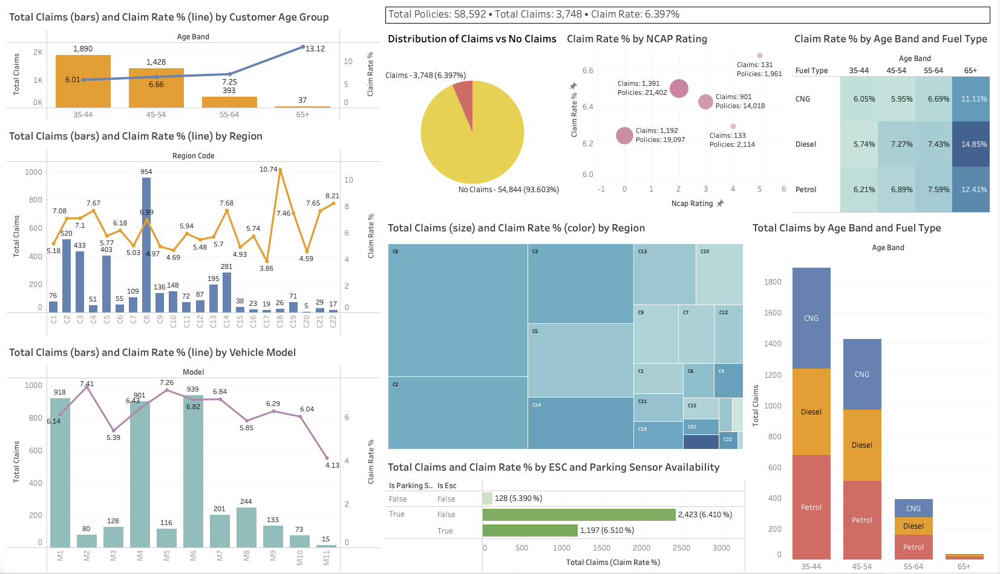

# Insurance Claims SQL + Tableau Dashboard


This project demonstrates end-to-end **data preparation, SQL analytics, and visualisation** of an insurance claims dataset with **58K+ policies**.  
Initially built with local SQL scripts, the project has been **modernised and migrated to Supabase (PostgreSQL Cloud)** to enable real-time data access and security implementation (RLS).  

The goal is to explore **claim rates** by region, customer demographics, vehicle models, and safety features, and to present the insights in an interactive **Tableau dashboard**.

---

## 📂 Project Structure

```
/insurance-claims-sql-project/
│
├── dashboard/
│   ├── Insurance Claims Dashboard.twb
│   └── dashboard_preview.png
│
├── docs/
│   ├── load_data_instructions.md  # step-by-step guide to import CSV and run SQL scripts
│   └── index.html		             # embed code to display Tableau Dashboard via GitHub Pages
│
├── raw data/                      # dataset
│   └── Insurance claims data.csv
│
├── results/                       # outputs of queries
│   ├── claims_by_age_region_fuel.csv
│   ├── claims_by_model.csv
│   ├── claims_by_age_group.csv
│   ├── claims_by_region.csv
│   └── claims_by_safety_features.csv
│
├── sql scripts/                   # all SQL scripts
│   ├── schema.sql                 # schema creation (staging + base tables)
│   ├── populate.sql               # insert data from staging to base tables
│   └── queries.sql                # analytical queries (claims by region, age, etc.)
│
├── supabase/
│   └── setup_complete.sql
│
└── README.md                      # project overview, steps, insights, dashboard
```

---
## ✨ New: Cloud Migration & Security
To simulate a modern production environment, this project now includes:
- **Cloud Database (Supabase):** Migrated from local PostgreSQL to a cloud-hosted database.
- **Automated Views:** SQL Views (`view_claims_by_region`, etc.) created to serve pre-calculated data directly to Tableau.
- **Security (Row Level Security):** Implemented **RLS policies** to secure the database, allowing public read access only to normalised tables while locking down raw staging data. RLS ensures that analytical consumers (e.g. dashboards) can only access
approved views and tables, while raw data remains protected.

This setup mirrors a real-world analytics pipeline where BI tools consume
secured, pre-aggregated data directly from a cloud database.

---

## 🚀 Steps in the Project

### 1. Data Preparation
- Loaded raw insurance dataset (`Insurance claims data.csv`) into a **staging table** (`stage_claims_raw`).
- Designed a relational schema with separate tables:
  - `policyholders`
  - `vehicles`

### 2. SQL Analytics
- Analytical queries to calculate:
  - Claim rates by **region**
  - Claim rates by **customer age group**
  - Relationship between **safety features** (ESC, parking sensors) and claims
  - Top vehicle models by claim count
  - Claim rates by **Age × Region × Fuel Type**

### 3. Visualisation & Reporting
- Exported SQL query outputs to CSV.
- Built an interactive **Tableau dashboard** with multiple pages:
  - **Overview**: Total policies, claims, claim rate
  - **By Region**: Claims & claim rates per region
  - **By Demographics**: Claims by age group & segment
  - **By Vehicle & Safety**: Vehicle models and safety features vs claim rates
- In the cloud setup, Tableau connects directly to Supabase SQL views,
eliminating the need for intermediate CSV exports.

---

## 📊 Dashboard Preview

The following dashboard was built in **Tableau** using query outputs:

 

You can interact with the live dashboard here:
[View Live Dashboard](https://moh-shz.github.io/insurance-claims-sql-project/) 

This dashboard is also published on Tableau Public:  
[View on Tableau Public](https://public.tableau.com/views/InsuranceClaimsDashboard_17584291725490/InsuranceClaimsDashboard?:language=en-GB&publish=yes&:sid=&:display_count=n&:origin=viz_share_link)

---

## 🔑 Key Insights
- **Claims by Age Group**: Younger and older age groups show different claim rates.  
- **Claims by Region**: Certain regions have disproportionately higher claim frequencies.  
- **Claims by Vehicle Model**: Some vehicle models are more prone to claims.  
- **Impact of Safety Features (ESC, Parking Sensors)**: Policies linked to vehicles with safety features show lower claim rates.  
- **Fuel Type & Age Group**: Claim rates vary across CNG, Diesel, and Petrol users, especially within younger age groups.  

---

## 📌 How to Reproduce

You can run this project in two ways: **Local (Manual)** or **Cloud (Recommended)**.

### 💻 Option 1: Local PostgreSQL (Legacy Approach)
1. Run the SQL scripts in `sql scripts/` (via PostgreSQL + pgAdmin).  
2. Import the dataset into the staging table (see [`load_data_instructions.md`](./docs/load_data_instructions.md)).  
3. Execute analytical queries (`queries.sql`).  
4. Export results to CSV (`results/`).  
5. Build the dashboard in Tableau or Power BI using the CSV outputs.  

### ☁️ Option 2: Cloud / Supabase (Modern Approach)
1. Create a new project on [Supabase](https://supabase.com).
2. Import the raw CSV file into a table named `stage_claims_raw` using the Table Editor.
3. Run the script located in `supabase/setup_complete.sql` in the Supabase SQL Editor.
   - This script creates the normalised schema, transfers data, builds analytical views, and applies security policies.
4. Connect Tableau/PowerBI directly to the Supabase database using the standard PostgreSQL connector.

**Note:** In the Supabase setup, Tableau can connect directly to SQL Views without exporting intermediate CSV files.

---

## 📑 Raw Data Source

The dataset used in this project comes from [Kaggle - Insurance Claims Dataset](https://www.kaggle.com/datasets/litvinenko630/insurance-claims).  
It contains **58K+ insurance policies** with details on policyholders, demographics, claim history, policy details, and vehicle risk factors.  

**License:** Apache 2.0
